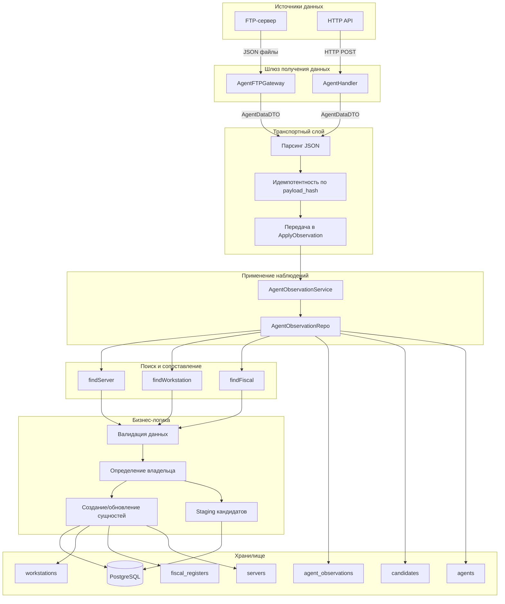

# Флоу агентских данных в Etalon-Server

## Обзор архитектуры

Документ описывает полный цикл обработки данных, поступающих от агентов мониторинга в систему Etalon-Server. Агентские данные используются для актуализации информации об IT-инфраструктуре: серверах, рабочих станциях и фискальных регистраторах.

---

## Диаграмма флоу данных



---

## 1. Источники данных

### 1.1 FTP-шлюз (AgentFTPGateway)

**Файл:** [`internal/core/gateways/agent_ftp_gateway.go`](internal/core/gateways/agent_ftp_gateway.go)

**Механизм:**
- Периодический опрос FTP-сервера по таймеру (интервал конфигурируется через `AgentFTPInterval`)
- Скачивание JSON-файлов в локальный кэш (`FTPCachePath`)
- Двухуровневая идемпотентность:
  1. Быстрая проверка по `mod_time` и `size` файла
  2. Точная проверка по `payload_hash` (SHA256 от содержимого)

**Ключевые функции:**
- [`Start()`](internal/core/gateways/agent_ftp_gateway.go:75) — запуск цикла опроса
- [`syncLocalCacheWithFTP()`](internal/core/gateways/agent_ftp_gateway.go:290) — синхронизация файлов
- [`processFile()`](internal/core/gateways/agent_ftp_gateway.go:517) — обработка одного файла (транспортная функция)
- [`computePayloadHash()`](internal/core/gateways/agent_ftp_gateway.go:667) — вычисление хеша для идемпотентности

**Важно:** FTP-шлюз является транспортным слоем и не выполняет бизнес-валидацию. Все решения о создании/обновлении сущностей принимаются в `ApplyObservation`.

**Типы файлов:**
- Числовые имена (например, `123456.json`) — данные фискальных регистраторов
- Строковые имена — данные серверов/рабочих станций

### 1.2 HTTP API

**Файл:** `internal/transport/http/handlers/agent_handler.go`

**Механизм:**
- REST API endpoint для прямой отправки данных от агентов
- Синхронная обработка с немедленным ответом
- Передача данных в `ApplyObservation` без дополнительной валидации

---

## 2. Структура входящих данных (AgentDataDTO)

**Файл:** [`internal/transport/http/dtos/dtos.go`](internal/transport/http/dtos/dtos.go:86)

```go
type AgentDataDTO struct {
    // Идентификаторы сервера
    URLRms    string  // URL/IP RMS-сервера
    CRMID     string  // CRM ID сервера
    
    // Идентификаторы рабочей станции
    Hostname      string  // Имя хоста
    TeamviewerID  string  // ID TeamViewer
    AnydeskID     string  // ID AnyDesk
    LitemanagerID string  // ID LiteManager
    
    // Данные фискального регистратора
    SerialNumber     string        // Серийный номер ФР
    ModelName        string        // Модель ККТ
    RNM              string        // РНМ ККТ
    INN              string        // ИНН организации
    FNSerial         string        // Номер ФН
    DateTimeEnd      string        // Дата окончания ФН
    DateTimeReg      string        // Дата регистрации ККТ
    OrganizationName string        // Название организации
    Address          string        // Адрес ФР
    Licenses         LicensesField // Лицензии
    
    // Метаданные агента
    CurrentTime  string  // Время на агенте
    AgentVersion string  // Версия агента
    AgentUUID    string  // UUID агента
    AgentType    string  // Тип агента
}
```

---

## 3. Этапы обработки данных

### 3.1 Транспортный слой (FTP Gateway)

**Место:** [`processFile()`](internal/core/gateways/agent_ftp_gateway.go:517)

Транспортная функция отвечает только за:
1. Чтение файла из локального кэша
2. Проверку идемпотентности по `mod_time`, `size` и `payload_hash`
3. Парсинг JSON в `AgentDataDTO`
4. Передачу данных в `ApplyObservation`

**Важно:** Бизнес-валидация НЕ выполняется в шлюзе. Все решения принимаются в `ApplyObservation`.

### 3.2 Регистрация наблюдения (ApplyObservation)

**Файл:** [`internal/infra/repositories/agent_observation_repo.go`](internal/infra/repositories/agent_observation_repo.go)

**Метод:** [`ApplyObservation()`](internal/infra/repositories/agent_observation_repo.go:124)

**Алгоритм:**
1. Вычисление хеша payload для идемпотентности
2. Создание записи `AgentObservation` со статусом `PROCESSING`
3. Проверка на дубликаты по `payload_hash` (идемпотентность)
4. Проверка на локальный адрес (игнорирование 127.x, 10.x, 192.168.x, 172.16-31.x)
5. Проверка на устаревшие данные (сравнение `observed_at` с `agent.last_observed_at`)
6. Поиск сервера по CRM ID, server_key или IP/URL
7. Определение владельца (для network-hub серверов)
8. Поиск/создание Workstation и FiscalRegister
9. При отсутствии сервера или remote IDs — создание кандидата

**Статусы наблюдения:**
- `PROCESSING` — в обработке
- `APPLIED` — успешно применено
- `STAGED` — отправлено в кандидаты
- `IGNORED` — отклонено (локальный адрес)
- `IGNORED_STALE` — отклонено как устаревшее
- `ERROR` — ошибка обработки

### 3.3 Поиск сущностей (Entity Matching)

**Методы поиска:**

#### Поиск сервера ([`findServer()`](internal/infra/repositories/agent_observation_repo.go:615))
1. По CRM ID (`crm_id`)
2. По server_key (UUID на основе URL)
3. По IP/URL (нормализованное сравнение)

#### Поиск рабочей станции ([`findWorkstation()`](internal/infra/repositories/agent_observation_repo.go:853))
1. По identity_hash (SHA256 от TV:LM)
2. По TeamViewer ID
3. По LiteManager ID
4. По AnyDesk ID

#### Поиск ФР
- По серийному номеру (нормализованному)

### 3.4 Определение владельца

**Метод:** [`resolveNetworkOwner()`](internal/infra/repositories/agent_observation_repo.go:1048)

**Алгоритм для network-hub серверов:**
1. Получение списка дочерних компаний hub-компании
2. Поиск существующего ФР среди дочерних компаний
3. Поиск существующей РС по remote IDs среди дочерних компаний
4. Если найден ровно один владелец — автоматическое присвоение

### 3.5 Создание/обновление сущностей

#### Рабочая станция ([`applyWorkstation()`](internal/infra/repositories/agent_observation_repo.go:667))

**Создание:**
- Присвоение owner_id от сервера
- Заполнение device_name, teamviewer, litemanager, anydesk
- Установка `is_new = true` (для выделения в UI)

**Обновление:**
- Обновление remote IDs
- Смена владельца (если не manual binding)
- Запись истории смены владельца

#### Фискальный регистратор ([`applyFiscal()`](internal/infra/repositories/agent_observation_repo.go:756))

**Создание:**
- Присвоение owner_id от сервера
- Заполнение всех атрибутов ФР

**Обновление:**
- Полное доверие данным агента (Full Trust)
- Обновление всех полей
- Запись истории смены владельца

### 3.6 Staging кандидатов

**Условия создания кандидата:**
1. Сервер не найден (srv == nil)
2. Отсутствуют remote IDs для идентификации РС (!hasRemoteID)

**Метод:** [`stage()`](internal/infra/repositories/agent_observation_repo.go:1380)

**Создаваемые записи:**
- `Candidate` — основная запись кандидата
- `CandidateWorkstationStaging` — данные РС для подтверждения
- `CandidateFiscalStaging` — данные ФР для подтверждения
- `ReconciliationTask` типа `candidate_connection`

### 3.7 Подтверждение кандидата (ApproveCandidate)

**Метод:** [`ApproveCandidate()`](internal/infra/repositories/agent_observation_repo.go:452)

**Алгоритм:**
1. Получение кандидата из БД
2. Создание или получение компании
3. Создание или получение сервера
4. Обработка всех staged-наблюдений
5. Создание/обновление Workstation и FiscalRegister

**Ручной ввод remote IDs:**
При подтверждении кандидата оператор может указать remote IDs вручную:
- `teamviewer_id` — ID TeamViewer
- `litemanager_id` — ID LiteManager
- `anydesk_id` — ID AnyDesk

Это используется когда агент не собрал remote IDs (программы удаленного доступа не установлены или не обнаружены). Приоритет: ручной ввод > значения из staging.

---

## 4. Событийная модель

### 4.1 Типы событий

**Файл:** [`internal/core/events/events.go`](internal/core/events/events.go)

| Событие | Payload | Описание |
|---------|---------|----------|
| `AgentDataReceived` | `AgentDataPayload` | Данные получены от агента |
| `AgentObservationRequested` | `AgentObservationPayload` | Запрос на применение наблюдения |

### 4.2 Подписчики

**Оркестратор:** [`internal/core/processing/orchestrator.go`](internal/core/processing/orchestrator.go)

```go
func (o *Orchestrator) Start(ctx context.Context) {
    o.bus.Subscribe(events.AgentDataReceived, o.handleAgentDataReceived)
    o.bus.Subscribe(events.AgentObservationRequested, o.handleAgentObservationRequested)
}
```

---

## 5. Модели данных

### 5.1 AgentObservation

**Файл:** [`internal/domain/models/agent_observation_models.go`](internal/domain/models/agent_observation_models.go:26)

```go
type AgentObservation struct {
    ID          uint           // PK
    Source      string         // Источник (имя файла или UUID агента)
    ObservedAt  time.Time      // Время наблюдения
    ServerKey   *string        // Ключ сервера (UUID от URL)
    ServerCRMID *string        // CRM ID сервера
    PayloadJSON datatypes.JSON // Полный payload
    PayloadHash string         // SHA256 хеш для идемпотентности
    Status      string         // Статус обработки
    
    // Связи с созданными/найденными сущностями
    WorkstationID      *string
    CandidateID        *uint
    NetworkCandidateID *uint
    FRID               *string
}
```

### 5.2 Candidate

```go
type Candidate struct {
    ID               uint           // PK
    ServerKey        *string        // Ключ сервера
    ServerCRMID      *string        // CRM ID
    ServerURL        *string        // URL сервера
    Status           string         // NEW, IN_REVIEW, APPROVED, REJECTED
    ExistingServerID *string        // ID существующего сервера (если найден)
    ApprovedCompanyID *string       // ID компании после подтверждения
    ApprovedServerID  *string       // ID сервера после подтверждения
}
```

---

## 6. Ключевые точки для добавления логирования

### 6.1 Критические точки (обязательно)

| Файл | Функция | Уровень | Событие |
|------|---------|---------|---------|
| `agent_ftp_gateway.go` | `processFile()` | DEBUG | Начало обработки файла |
| `agent_ftp_gateway.go` | `processFile()` | INFO | Успешная валидация |
| `agent_ftp_gateway.go` | `processFile()` | WARN | Пропуск файла (причина) |
| `agent_observation_repo.go` | `ApplyObservation()` | INFO | Регистрация наблюдения |
| `agent_observation_repo.go` | `ApplyObservation()` | DEBUG | Результат поиска сервера |
| `agent_observation_repo.go` | `ApplyObservation()` | DEBUG | Результат поиска РС |
| `agent_observation_repo.go` | `ApplyObservation()` | INFO | Создание кандидата |
| `agent_observation_repo.go` | `applyWorkstation()` | INFO | Создание/обновление РС |
| `agent_observation_repo.go` | `applyFiscal()` | INFO | Создание/обновление ФР |
| `agent_observation_repo.go` | `resolveNetworkOwner()` | DEBUG | Определение владельца |

### 6.2 Рекомендуемые точки (опционально)

| Файл | Функция | Уровень | Событие |
|------|---------|---------|---------|
| `agent_ftp_gateway.go` | `runReconciliationCycle()` | INFO | Статистика цикла |
| `agent_observation_repo.go` | `findServer()` | DEBUG | Критерии поиска |
| `agent_observation_repo.go` | `findWorkstation()` | DEBUG | Критерии поиска |
| `agent_observation_repo.go` | `isStaleByAgentStream()` | DEBUG | Проверка устаревания |

---

## 7. Рекомендации по добавлению дебаг-логов

### 7.1 Шаблон логирования

```go
log := s.logger.With(
    "observation_id", obs.ID,
    "source", source,
    "server_key", serverKey,
)

log.Debug("Начало поиска сервера",
    "crm_id", crmID,
    "normalized_rms", normalizedRMS,
)

// ... логика поиска ...

log.Debug("Результат поиска сервера",
    "found", srv != nil,
    "server_id", ptrValue(srv.ID),
    "owner_id", ptrValue(srv.OwnerID),
)
```

### 7.2 Ключевые поля для трассировки

Обязательные поля для всех логов в контексте обработки агента:
- `source` — источник данных (имя файла или UUID агента)
- `observation_id` — ID наблюдения (после создания)

Дополнительные поля по контексту:
- `server_key`, `server_crm_id` — идентификаторы сервера
- `workstation_id`, `fr_id` — ID найденных/созданных сущностей
- `candidate_id` — ID кандидата (если создан)

### 7.3 Уровни логирования

| Уровень | Когда использовать |
|---------|-------------------|
| DEBUG | Промежуточные шаги, критерии поиска, результаты сравнения |
| INFO | Ключевые события: создание/обновление сущностей, смена статуса |
| WARN | Некритичные проблемы: пропуск файла, устаревшие данные |
| ERROR | Ошибки, требующие внимания: ошибка БД, невалидные данные |

---

## 8. Пример полного флоу (Happy Path)

```
1. FTP Gateway скачивает файл "12345.json"
   └─> Лог: "Обнаружен новый/обновленный файл"

2. Парсинг JSON в AgentDataDTO
   └─> Лог: "JSON успешно распарсен"

3. Валидация данных
   └─> Лог: "Валидация данных агента завершена успешно"

4. Проверка на дубликат по payload_hash
   └─> Новый хеш, продолжаем

5. Создание AgentObservation (status=PROCESSING)
   └─> Лог: "Наблюдение зарегистрировано"

6. Поиск сервера по CRM ID
   └─> Лог: "Сервер найден для наблюдения"

7. Проверка на network-hub
   └─> Не hub, продолжаем

8. Поиск рабочей станции по TeamViewer ID
   └─> Лог: "РС найдена" или "РС не найдена"

9. Создание/обновление Workstation
   └─> Лог: "Работа с наблюдением применена"

10. Поиск ФР по серийному номеру
    └─> Лог: "ФР найден" или "ФР не найден"

11. Создание/обновление FiscalRegister
    └─> Лог: "ФР применен"

12. Обновление статуса AgentObservation (status=APPLIED)
    └─> Лог: "Наблюдение успешно применено"
```

---

## 9. Архитектурные особенности

### 9.1 Идемпотентность

Обработка данных идемпотентна на двух уровнях:

1. **Уровень файла (быстрая проверка):**
   - Проверка `mod_time` и `size` в таблице `agent_files`
   - Позволяет быстро пропустить неизменённые файлы без чтения содержимого

2. **Уровень payload (точная проверка):**
   - Вычисление SHA256 хеша от содержимого файла
   - Проверка `payload_hash` в таблице `agent_observations`
   - Гарантирует идемпотентность даже при изменении метаданных файла

### 9.2 Защита от устаревших данных

- Сравнение `observed_at` с `agent.last_observed_at`
- Пропуск данных, которые старше последнего обработанного
- Защита от обработки старых файлов при восстановлении связи

### 9.3 Trusted Update Rules

| Сущность | Правило |
|----------|---------|
| Server | Read-only (только owner_id и crm_id) |
| Workstation | Доверие для teamviewer, litemanager, hostname |
| FiscalRegister | Полное доверие (Full Trust) |

### 9.4 Network Hub логика

Для серверов с `owner_mode = network_hub`:
- Автоматическое определение дочерней компании-владельца
- При невозможности определить — создание NetworkCandidate

---

## 10. Связанные файлы

| Категория | Файлы |
|-----------|-------|
| Шлюзы | `internal/core/gateways/agent_ftp_gateway.go` |
| Сервисы | `internal/services/agent_observation_service.go` |
| Репозитории | `internal/infra/repositories/agent_observation_repo.go` |
| Модели | `internal/domain/models/agent_observation_models.go` |
| DTO | `internal/transport/http/dtos/dtos.go` |
| Обработка | `internal/core/processing/engine.go`, `orchestrator.go`, `reconciliation.go` |
| Handlers | `internal/transport/http/handlers/candidate_handler.go` |
